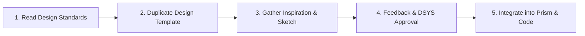

# Icon Design Principles & Process Guidance

This document captures the foundational principles, qualification criteria, core design values, and contribution process for icons in the design system.

---

## 1. Ask Yourself (Qualification & Scoping Criteria)

Before proposing or designing a new icon, work through these four evaluation questions:

### 1.1 Does your icon already exist?
- **Always search the icon library first** before creating a new icon.
- In most cases, an existing icon or an approved variant will satisfy the use case.

### 1.2 Do you need a new icon?
An icon should only be added if it meets at least **1 of the 4 qualifications**:
1. **Product Identity**: It serves as a distinct product or brand identity symbol.
2. **New Concept**: It communicates a distinct, novel concept that cannot be clearly conveyed by any existing icon.
3. **Recognized Metaphor**: The proposed metaphor is standard, intuitive, and widely distinguishable in the domain/industry.
4. **Universal Utility**: It has high potential to be used broadly and universally across products, features, and teams.

### 1.3 Do you have enough time?
- Standard turnaround to design, refine, review, and produce a production icon is **1 to 2 weeks**.
- Every icon goes through:
  - **Review**: Design Systems (DSYS) critique and optical balance verification.
  - **Release Integration**: Addition into the icon asset packages and code repositories.
  - **Documentation**: Naming conventions, usage guidelines, and keywords recorded in the system.

### 1.4 Will this icon be used in other contexts?
- Icons should not be single-use decorations for an isolated feature.
- Consider whether the metaphor is general enough for other teams, platforms, or product surfaces to reuse.

---

## 2. Icon Design Values

All icons must adhere to four core pillars:

```
  ┌──────────────┐     ┌──────────────┐
  │   Readable   │     │  Meaningful  │
  └──────────────┘     └──────────────┘
  ┌──────────────┐     ┌──────────────┐
  │   Classic    │     │   Reusable   │
  └──────────────┘     └──────────────┘
```

### 2.1 Readable
- **Silhouette recognition**: Shapes must be immediately identifiable at a glance.
- **Size scalability**: Must remain crisp, sharp, and unambiguous at both small (16px) and standard (24px) sizes.
- **Negative space**: Maintain consistent counter-spaces and clearances to prevent optical clogging.

### 2.2 Meaningful
- **Clarity of intent**: The icon should unambiguously represent the action, object, or state it depicts.
- **Metaphor fidelity**: Use metaphors that users immediately comprehend without explanation. Avoid obscure or culturally ambiguous symbolism.

### 2.3 Classic
- **Timeless geometry**: Grounded in simple geometric primitives (circles, squares, rectangles, 45° angles).
- **Avoid trends**: Reject superfluous ornamentation, heavy stylistic gimmicks, or temporary visual trends.
- **System consistency**: Feel like an inseparable part of the broader icon family.

### 2.4 Reusable
- **Multi-surface versatility**: Designed to work cleanly in navigation, action buttons, table rows, badges, and status banners.
- **Modular variants**: Seamless pairing between `-line` (stroke) and `-fill` (solid) states.

---

## 3. Process Overview (5-Step Contribution Workflow)



1. **Read the Icon Design Standards**:
   - Review the technical specifications in [icon-construction-spec.md](icon-construction-spec.md) (stroke width = 2px, live areas, keyline shapes, terminal caps, corner radii).
2. **Duplicate the Design Template**:
   - Use the official 16×16 and 24×24 icon grids with standard keylines (circle, square, vertical/horizontal rect).
3. **Gather Inspiration and Sketch**:
   - Explore multiple conceptual metaphors, iterate on skeleton centerlines, and test rendering at 100% scale in context.
4. **Get Feedback and Approval from DSYS**:
   - Present concepts to the Design Systems team for critique, optical weight adjustment, and formal sign-off.
5. **Integrate into Prism & Use in Apps**:
   - Generate production SVGs (`*-line.svg` and `*-fill.svg`), apply proper naming/metadata, and publish into the component library.
